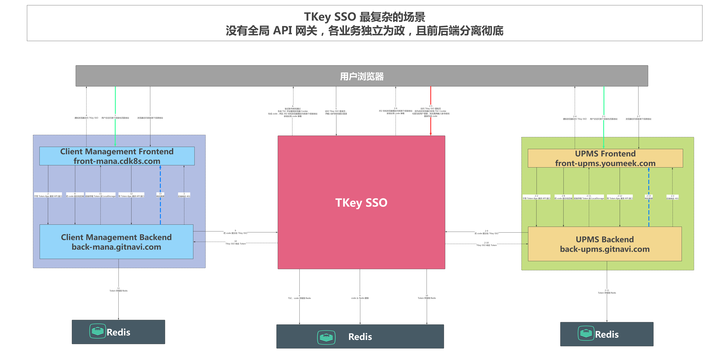

## 运行配置
### nginx + host 统一端口号
```txt
# sso
127.0.0.1 sso.honezhi.com
127.0.0.1 redis.honezhi.com
127.0.0.1 client1.honezhi.com
127.0.0.1 client2.honezhi.com
```

```conf
    server {
        listen       80;
        # 根据域名拦截http服务
        server_name  sso.honezhi.com;    
        # 设置访问日志存储位置和名称
        access_log   logs/portal.access.log;  

        # 允许跨域
        add_header Access-Control-Allow-Origin *;       
        add_header Access-Control-Allow-Headers X-Requested-With;
        add_header Access-Control-Allow-Methods GET,POST,OPTIONS;

        location / {
             # 转发请求中的Host头部
            proxy_set_header  Host  $host;
            proxy_set_header  X-real-ip $remote_addr;
            proxy_set_header  X-Forwarded-For $proxy_add_x_forwarded_for;
            
            proxy_pass http://sso.honezhi.com:9091;
        }

    }
```

## 登录

- 登录流程: 
- 部署架构: 

### 密码登录


## 接口文档

### swagger-api
- 默认地址: http://sso.honezhi.com/sso/v2/api-docs